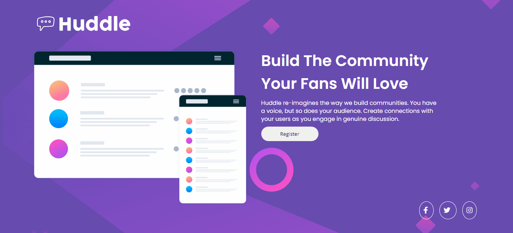
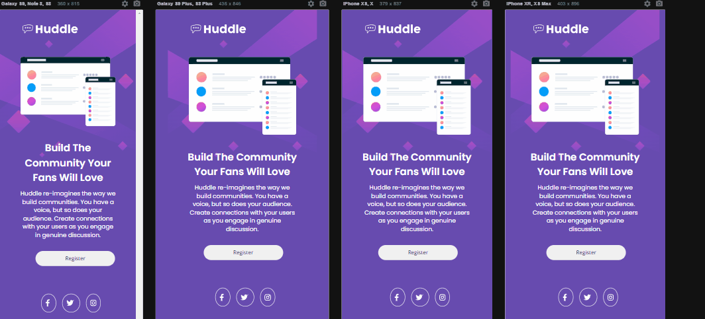

# Frontend Mentor - projeto da página inicial do Huddle com uma seção de introdução única

## Bem-vindo! 👋

- Essa e a resolução do projeto [Huddle landing page with single introductory section challenge on Frontend Mentor]
- Que se encontra no seguite site: (https://www.frontendmentor.io/challenges/huddle-landing-page-with-a-single-introductory-section-B_2Wvxgi0).
- Um desafio perfeito para iniciantes, este projeto permitirá que você trabalhe com um layout de duas colunas.

## Objetivos 🎯

- Construir um layout de uma página onde o usuario passar utilizar na versão desktop e mobile.
- utilização de elementos interativos.
- Usando HTML e CSS.

## Screenshots

### Desktop

### Mobile

### Elementos interativos

Os elementos interativos usados como monstrado nas imagens acima, são feitos usado pseudo-classe (:hover).

## Processo

### Construção do projeto

<ol>
<li>HTML tags semânticas</li>
<li>CSS</li>
<li>Flexbox</li>
<li>CSS Grid</li>
<li>Medias queries</li>
</ol>

### Aprendizado 🚀

Consegui colocar em prática os estudos de HTML e CSS, onde utilizei algumas tags semânticas, como header, section e footer. Aprimorei meu conhecimento em CSS, utilizando grid e flexbox, além de empregar pseudo-classes. Também aprendi a tornar o site responsivo para uma melhor visualização em dispositivos menores.

### Projeto em desenvolvimento ⏳

Pretendo ainda dar continuidade no projeto fazendo melhorias utilizando JavaScript e criar outros projetos de acordo com o progresso dos estudos.

### Autor

- GitHub - [Davison Silva] https://github.com/davison-silva
- Frontend Mentor - https://www.frontendmentor.io/profile/davison-silva
- E-mail - davisonsnascimento@gmail.com